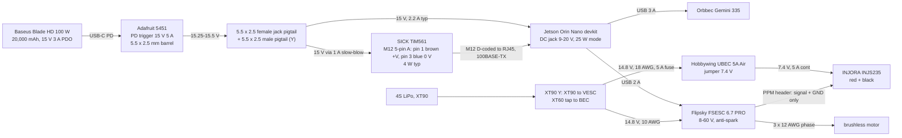

# New car ("KA2246-R00"): layout on Baseplate v2

`python3 board_layout_newcar.py` builds everything in this directory, checks it and writes
`out/newcar_layout_{top,bottom,side,front,lines}.png`, `out/newcar_layout_assembly.step`
and `out/newcar_layout_report.json`. `LAYOUT=above` builds the fallback arrangement
(section 5), `VESC=rear` / `VESC=saddle` the two VESC positions, `UNDER_CLEARANCE=40
TAG=_uc40`, `BANK_L=161.8 TAG=_blade100`, `BANK_W=161.8 TAG=_blade100w` and
`CAM_HEIGHT=150 TAG=_cam150` the variants quoted below. Frame as the old car: +x forward,
+y car left, +z up, origin at the plate centre, plate top at z 0; hole names A..D (rows,
car left to right) x 1..6, 8 (columns, front to rear), 40 x 41 mm grid (`../LAYOUT.md`
section 13).

## 0. Result in one paragraph

The new chassis is a Traxxas Slash 4x4 on the standard 6822 chassis (68086-4 VXL /
68054 / 68154-4 BL-2s family): the cue "steering servo vertical, output down, in the front
bulkhead on the side opposite the battery" matches the 68086-4 exploded view (servo 2075
inverted on bulkhead 6830 with servo saver 6845 below it) and matches neither the 2WD Slash
(servo upright in the 5822 tub) nor the LCG Slash 4x4 Ultimate (servo on its side in the
7422 chassis). Confidence: about 90 % on the family, moderate on which side the servo sits
(section 7). Five mounts go on the board: the SICK TiM561 plinth in front on four feet
(A1+B1+A2+B2), the camera mast directly behind it (A3+B3, `CAM_HEIGHT` 170), the
Jetson tray (the old set's `_under` snap tray, used upright) above on D2+D3, the power
bank tray hanging under the plate on B5+C5+B6+C6, the cable tidy on the right edge; the
VESC is on the old car's tub-rail saddle in the right bay (or, `VESC=rear`, on its tray
above the rear column B8+C8). All four mast legs are inside the TiM561's 90 degree blind
sector, so the lidar's 270 degrees are completely clear. Every mount, foot, clipless piece,
envelope and the plate check at zero mutual interference; the only non-zero rows in the
default layout are the hanging bank tray against the *estimated* Slash 4x4 transmission and
motor heights (5.7 and 6.7 mm, section 4), which is the first thing to measure on the car.
If those are as tall as estimated, `LAYOUT=above` (bank upright above the plate at the rear,
Jetson hanging under as on the old car) is fully zero-interference in the model, at the
cost of 445 g carried 30 mm higher.

## 1. The chassis and what changes from the old car

| | Slash 2WD 58034 (old car) | Slash 4x4 6822 chassis (new car) | source |
| --- | --- | --- | --- |
| wheelbase | 335 mm | 324 mm | traxxas.com specifications, quoted at hobbytown.com/traxxas-slash-4x4-vxl-brushless-1-10-4wd-rtr-short-course-truck-fox-tra68086-4-fox/p630449 |
| width / height / ground clearance | 296 / 214 / 89 | 296 / 193 / 72 | same |
| mass without battery | 2.16 kg | 2.64 kg | same |
| steering servo | upright in a tub pocket, x 122..142 | inverted in the front bulkhead 6830, output shaft down, four 3x6 FCS (3932), servo saver 6845 below | exploded view 68086-4 p.2, rcscrapyard.net/manuals/traxxas/68086-4/68086-4-002.jpg |
| battery | left bay, 165 x 50 x 23 | left bay, lengthwise ("6-7 cell NiMH and various LiPo") | traxxas.com; hobbytown |
| motor | transverse 550 right of the transmission | transverse, at the rear next to the centre transmission; side ESTIMATED right | exploded view |
| drivetrain under the plate | none | centre driveshaft down the middle | exploded view |

Everything in the keep-out model that is not the wheelbase, width or ground clearance is an
ESTIMATE and a parameter in `CHASSIS` (env var of the same name, JSON): tub 300 x 100, 24 deep
(the 6822 has low sides; the saddle's legs grip 18 of it); battery bay x -75..65, y 15..62,
hold-down rim +6; transmission x -160..-110, y +-25, top rim +22; motor 36 x 60 at x -125 on
the right, axis rim +5 (top rim +23); centre shaft y +-8, top rim -8; servo 20 x 56 in plan at
x 128..150, y -53..3, top rim +25; bellcranks x 140..185, y +-40, rim +12; tyres 110 x 42 with
their tops rim +14 at ride (110 - 72 ground clearance - 24 tub) swept 30 up and +-30 degrees
of lock. The towers: front kept at the old plate's clamp (x 168.3), rear moved 11.4 mm
forward to x -141.7 so the axles are 324 apart (`baseplate_v2_newcar.py`, `REAR_SHIFT`).

The plate: `baseplate_v2_newcar.py` re-emits Baseplate v2 with the rear body-post cutouts
at x -127.68 (were -139.08) and the rear clamp holes at x -138.33 (were -149.73); the front
pair, the outline, the 28-hole grid, the zip and M3 holes are unchanged; the web check still
passes (A6/B6/C6/D6 keep 8.19 mm to the moved cutouts, the minimum is 8). **The two shifts
are guesses from the wheelbase alone; measure the tower spacing and post spacing before
cutting** (section 8). `out/baseplate_v2_newcar.dxf`.

## 2. Placement (hole assignment, both faces)

| mount | face | holes | centre (x, y) | rot | where it ends up (extents from the run) |
| --- | --- | --- | --- | --- | --- |
| TiM561 plinth (`tim561_mount.py`) | above | A1, B1, A2, B2 | (95, 41) | 0 | plinth x 55.5..142.46, y 0.25..81.75, 44.4 tall; lidar housing x 78.2..139.2, y 11..71, hood top 99.75; scan plane 76.46 above the plate; the swivel connector unit and two M12 plugs point aft to x 15.8 at z 15.5..30.5 (estimates), between the mast's legs |
| camera mast + head (`../camera_mast_mount.py`, `CAM_HEIGHT` 170, `LIDAR_X` 60, `LIDAR_Y` 0) | above | A3, B3 | (35, 41) | 0 | bar x 14.75..55.25, y 0..82; 0.25 mm behind the plinth's bar; lens (54, 41, 170) at 0 pitch; camera 156..181 |
| Jetson Orin Nano (`../out/jetson_orin_nano_under.stl`, the two-foot snap tray, upright) | above | D2, D3 | (55, -61.5) | 180 | tray x 1.5..108.5, y -104.5..-18.5 (15.75 outside the right edge), kit top 43.2; connectors outboard; channel opens forward |
| power bank tray (`battery_bank_underslung.py`, Blade HD) | below | B5, C5, B6, C6 | (-65, 0) | 0 | tray x -131.45..9.45, y +-70.45, 31.88 deep (plate 3.175 + 28.7); bank x -127.95..5.95, ports forward |
| cable tidy, edge (`../cable_tidy_mount.py`, `EDGE=1`) | edge | M5 through the zip holes at (-105, -82), (-145, -82) | (-62, -107) | 0 | rail x -152..-12, y -125.6..-76, 23.5 tall; unchanged from the old car |
| VESC FSESC 6.7 PRO on the tub saddle (`../vesc_tub_bracket_mount.py`) | chassis rail | none | (74.75, -54.5) | 90 | x 25.25..124.25, y -117.5..8.5, floor rim -6, case rim +3..27.5, fingers rim +29.8 |
| `VESC=rear`: VESC tray (`../vesc_fsesc67_mount.py`, recess, `PEG_PITCH` 41) | above | B8, C8 | (-185, 0) | 90 | tray x -234.5..-135.5 (8.5 past the rear edge), y +-51, case top 33.5; phase leads to the right through D8, XT90 to the left through A8 |

Unused holes: C1, D1, C2, C3, A4, B4, C4, D4, A5, D5, A6, D6, A8, B8, C8, D8 (B8/C8 taken by
`VESC=rear`). Rear body posts come off (`POSTS=front`): they would pass through the bank
tray's footprint on either face. Checks that passed: no hole claimed twice, every foot's peg
centre within 2.5 mm of its hole, every part one solid, the 8 mm webs.

Why these positions and not others:

- Lidar on rows A/B, not centred on B/C. The plinth's four feet are on two rows, so the
  lidar centre is on a row boundary: y 41 or y 0. Centred (B1+C1+B2+C2) the mast has to be
  on B3+C3 to stay behind it, and its C3 piece's flange under the plate (x 18.5..51.5,
  y -37..-4) is where the Jetson tray must be (the same conflict as `../LAYOUT.md` section
  19). On A/B the lidar is 41 mm left of the centreline (the C1 was 20.5) and everything on
  rows C/D is free for the Jetson.
- Mast directly behind the lidar (60 mm from feet centre to feet centre, same row): the
  TiM561's blind sector is the rear 90 degrees, and at the scan height (76.46) the four legs
  have converged to |dy| 27 at dx -47/-73 from the lidar axis, i.e. bearings 156 and 163
  degrees (section 3): all four inside the blind sector. One column further back (A4+B4) they
  would still be inside, but the camera would see more of the lidar (section 3) and the bar
  would be 3.25 mm from the bank's B5 piece.
- Jetson above, on the `_under` tray. The recess tray (4 feet at 40 x 41) is 86 wide and
  centred on a row boundary (y -41): its +y edge at y 2 lands 1.25 mm into the mast's bar
  (y 0.75..81) whatever column it is on. The two-foot snap tray hangs from a single row
  (D2+D3, y -61.5) and clears the bar by 18.5 mm; it works upright as well as hanging (the
  dovetail channel and tongues do not care about orientation, `../snap_retain.py`). D2+D3
  rather than D1+D2: 11.6 mm from the front-right tyre's lock + bump sweep instead of inside it.
- Bank on columns 5-6. The bank tray is 140.9 square, wider than the 90 mm between the
  row-A and row-D flange zones, so no above-board clipless mount can share its columns, and
  no from-below flange may reach over it. Columns 4-5 (x -91..49) would clear the
  transmission, but the mast's A3/B3 flanges reach x 51.5 under the plate: 3830 + 1149 mm3
  into the tray (checked). Columns 5-6 (x -131.45..9.45) is the only pair with nothing over
  it; the tray is shifted 4 mm forward on its feet (`BANK_X_OFFSET`) so its rear end clears
  the moved rear clamp blocks (2.49 mm) and the rear shock caps.
- VESC. With the bank under columns 5-6 and the Jetson above, the right bay under the
  plate between the bank (x 9.45) and the servo (x 128) is free, so the old car's saddle goes
  there unchanged (`SADDLE_X0` 25.25: 15.8 mm behind the bank tray, 3.75 ahead of the servo
  estimate, 2.35 mm under the Jetson's D2/D3 flanges). The 6822 chassis may not have a rail
  the saddle can grip (section 8); `VESC=rear` puts the FSESC tray on the plate top at the
  rear instead, turned 90 so its two feet sit across on B8+C8, 4.3 mm behind the rear body
  posts (which are off anyway) and 13 mm inboard of the tidy. Both are zero-interference.

## 3. What the lidar sees, and what the camera sees

TiM561: 270 degree aperture, -45 to 225 in SICK's convention, 0 degrees to the sensor's left
and 90 dead ahead, so the blind sector is dead astern +-45 (datasheet bottom view; the
connectors are in it). Board-frame bearings below are from dead ahead, positive left; SICK
angle = 90 + bearing.

Scan plane 76.46 above the plate top (deck 14 + 62.46). The script slices every other solid
at that height:

| what | range (mm) | bearing (deg) | width (deg) | sector | SICK angle | in the blind sector? |
| --- | --- | --- | --- | --- | --- | --- |
| mast front-right leg | 62.6 | -156.0 | 6.8 (7.7 analytic) | -159.3 .. -152.5 | 291 .. 298 | yes |
| mast rear-right leg | 87.1 | -162.7 | 4.8 (5.7) | -165.0 .. -160.2 | 285 .. 290 | yes |
| mast front-left leg | 62.6 | 156.0 | 6.8 (7.7) | 152.5 .. 159.3 | 242 .. 249 | yes |
| mast rear-left leg | 87.1 | 162.7 | 4.8 (5.7) | 160.2 .. 165.0 | 235 .. 240 | yes |
| everything else | | | | | | nothing reaches 76 mm: Jetson kit 43.2, VESC tray 35.8 (rear option), bank tray (above option) 28.7, body posts 25, tidy 23.5, tyres at full bump -4 |

Visible occlusions: none. The nearest leg edge is 17.5 degrees inside the blind sector
(bearing 152.5 vs the 135 limit). Nothing needs masking in the driver; the 0.05 m minimum
range is irrelevant because nothing is in view under 0.1 m. On the old car the C1 (360
degrees) lost 27 degrees to the same legs.

Camera (Gemini 335, depth V FOV 65, RGB 55; orbbec.com): the TiM561 is 100 mm tall, 44 mm
taller than the C1, and its hood's front top rim (x 129.7, z 99.75) is the first thing to
enter the bottom of the image. With the mast on column 3 the lens is 75.7 mm behind it:

| `CAM_HEIGHT` | lens z at 0 pitch | hood top elevation from the lens (deg) | margin below the depth image at 0 pitch (deg) | hood enters the depth image at pitch | the RGB image at |
| --- | --- | --- | --- | --- | --- |
| 150 (old car) | 148.9 | -33.0 | 0.5 | -0.5 | -5.6 |
| 170 (default) | 168.9 | -42.4 | 9.9 | -10.7 | -15.8 |
| 190 | 188.9 | -49.7 | 17.2 | -18.8 | -23.9 |

So at 150 the hood is in the frame the moment the head pitches down; 170 buys a clean
image down to -10 degrees at the cost of 20 mm longer legs (tip deflection goes with length
cubed: x1.74, about 0.35 mm fore-aft at 5 g instead of 0.2; first mode down about 25 %). Below
-10.7 the hood occupies the bottom rows of the depth image at 7.5..10 cm from the lens,
inside the camera's near limit, so it shows as invalid depth, not as an obstacle; mask those
rows if the head is run pitched. Moving the mast a column back makes it worse (the hood's
elevation angle flattens: at column 4 with 170 it enters at about -1). The lidar's own top
is 41 mm ahead of the lens in x and 69 below it.

## 4. Interference and clearances

Pairwise intersections over all 62 solids (5 mounts as 6 parts, 12 feet, 12 clipless pieces,
7 envelopes, the saddle and its case, 20 chassis keep-outs, the plate and its 4 clamp blocks).

| pair | `LAYOUT=under` (default), UC 45 | UC 40 | `LAYOUT=above`, UC 45 |
| --- | --- | --- | --- |
| power bank x transmission model (top rim +22) | **3052 mm3** (bank bottom rim +16.3, 5.7 into it over x -131..-110) | 7539 | 0 |
| power bank / tray x motor model (top rim +23) | **1992 + 553** (6.7 into it over x -131..-107) | 5519 + 872 | 0 |
| plate rear clamp x transmission model | 0 | 2502 (as on the old car: the chassis estimate, not the layout) | 0 |
| Jetson D2/D3 flanges x VESC case / saddle (saddle option) | 0 (2.35 mm) | 381 + 263 + 16 | - |
| everything else | 0 | 0 | 0 (0 pairs) |

The three non-zero rows of the default layout are one fact: the bank tray's underside is
28.7 mm below the plate underside over x -131.45..9.45, |y| < 70.45, and the model's
transmission and motor stand 22-23 mm above the chassis rim, i.e. only 22-23 below the plate
underside at `UNDER_CLEARANCE` 45. If the real gear cover and motor can are more than 29 mm
below the plate underside there, the layout is clean as drawn; if not, use `LAYOUT=above`.
`BANK_L=161.8` (Baseus Blade 100 W lengthwise) reaches the rear tower, clamp blocks and the
column-3 flanges (20 intersecting pairs); `BANK_W=161.8` (crosswise) reaches the cable
tidy's M5 nuts under the plate edge (250 mm3, tray y +-84.4 vs nuts at y -86.75..-77.25).
Only the 133.9 mm square Blade HD fits.

Under-board clearance (`clearance_report`): bank tray bottom 31.88 below the plate top;
over the battery bay's hold-down 10.3 mm at UC 45 (5.3 at 40, 0.3 at 35); the transmission
and motor as above. `LAYOUT=above`: the Jetson kit 46.35 deep, 1.83 over the rim at 45 (into
it at 40), as on the old car.

Closest approaches at UC 45, default layout (bounding-box gaps from the run): plinth bar to
mast bar 0.25 (both float +-1.25 on their channels; touching costs nothing); bank tray rear
end to the rear clamp blocks 2.49 (x), to the rear tower 8.29, to the tidy's M5 nuts 6.8 (y),
to the mast bar 3.17 (z, different faces); saddle to the servo estimate 3.75 (x), to the
D2/D3 flanges 2.35 (z), to the bank tray 15.8 (x); Jetson tray to the mast bar 18.5 (y), to
the plinth 18.75, to the front-right tyre's lock + bump sweep 11.64 (x) and 4.17 (z: the
swept tyre tops out 4 mm under the plate in this chassis model); tidy rail to the rear tyre
sweep 4.17 (z); lidar's B1 flange to the servo 7.15 (z), to the bellcrank model 20.15; lidar
to the front-left tyre sweep 18.17. `LAYOUT=above`: VESC rear tray to bank tray 4.05 (x),
saddle option to the motor 2.0 (x) and to the bank's C5/C6 flanges 2.35 (z).

The saddle, fixed to the chassis, comes up toward the plate as UNDER_CLEARANCE shrinks
(`tub_report`): plate-underside margin 15.2 / 10.2 / 5.2 at 45 / 40 / 35; the Jetson's D2/D3
flanges hit its fingers at 40 (as the D1/D2 pair did on the old car). 45 is the number to
confirm first.

## 5. The fallback: `LAYOUT=above`

Bank tray upright ABOVE the plate on the same holes (B5+C5+B6+C6, from-below pieces), 28.7
tall, bank top 26.4 above the plate; Jetson hanging under D2+D3 exactly as on the old car
(`../out/jetson_orin_nano_under.stl`, 46.35 deep); VESC on the rear tray (B8+C8, default for
this layout; 4.05 mm behind the bank tray) or on the saddle at the rear right (`VESC=saddle`,
`SADDLE_X0_ABOVE` -105: x -105..-6, 7.5 behind the Jetson tray, 2.0 ahead of the motor model).
Zero intersecting pairs among 66 solids at UC 45. Cost: 445 g at +13 mm mean height instead
of -21, and the Jetson back in the tightest spot on the car (1.83 mm over the rim).

## 6. Power tree

Decision: one 15 V rail from the power bank through the Adafruit PD trigger feeds the
Jetson and the TiM561; the servo has its own 7.4 V BEC on the 4S LiPo; the VESC is on the
LiPo. Numbers:

- Bank: Baseus Blade HD 100 W, 20,000 mAh (74 Wh nominal), USB-C1 PDOs 5 V 3 A / 9 V 3 A /
  12 V 3 A / 15 V 3 A / 20 V 5 A (baseus.com product page; the PDO list is the Blade
  100 W family's, confirm on the HD before buying, section 8). 133.9 x 133.9 x 17.8 mm, 445 g.
- Trigger: Adafruit 5451, USB-C PD to 5.5 x 2.5 mm centre-positive barrel, 15 V, 5 A rated,
  1.2 m (adafruit.com/product/5451; one datasheet for the 5449/5450/5451/5452 family; 5449 is
  the 9 V one). Output runs 0.25-0.5 V over nominal, so expect 15.25-15.5 V. If the bank has
  no 15 V PDO the cable falls back to 5 V and the Jetson will not boot; nothing is damaged.
- Jetson Orin Nano Developer Kit: DC jack 5.5 x 2.5 mm, 9-20 V, jack rated 3.5 A
  (carrier board specification SP-11324-001 v1.1 section 3.8; docs.nvidia.com hardware
  layout). Power modes 7 / 15 / 25 W (default on Super) / MAXN_SUPER. Budget at 15 V: 25 W
  module + 10 % carrier loss + camera on USB 3 (4.5 W, a port's 5 V 0.9 A) + VESC USB 0.5 W =
  about 33 W, 2.2 A.
- TiM561: 9-28 V DC, typ. 4 W (datasheet), no maximum published; the operating instructions
  require an external 0.8 A slow-blow fuse and a supply that never dips under 8 V for more
  than 2 ms. At 15 V: 0.27 A typical, the 0.8 A fuse rating implies under 12 W at start.
- Rail total: 37 W typical (2.5 A), 45 W (3.0 A) with the lidar's start-up allowance, i.e.
  exactly the 15 V PDO. Keep the Jetson in the 25 W mode (not MAXN_SUPER) and it fits; if the
  Jetson is ever run uncapped, move the lidar to the LiPo (below). The 20 V PDO would give 100
  W but 20.25-20.5 V is over the Jetson's 20 V limit, so it is not an option.
- Run time: 74 Wh x 0.85 conversion / 37 W = about 1.7 h; 1.4 h at 45 W.
- Lidar alternative, 4S LiPo (12.8-16.8 V, inside 9-28): works, through a 1 A slow-blow fuse
  from an XT60 tap. Not chosen because the lidar then dies when the drive battery is pulled
  (bench, mapping on a stand) and because the LiPo rail carries the motor's switching noise;
  Ethernet is transformer-isolated so grounding is not the reason either way.
- Servo: INJORA INJS235, 4.8-8.4 V, 35 kg.cm at 8.4 V, 25 at 6.0 V (injora.com). Its stall
  current is not published; 35 kg class servos draw 3-6 A at stall. The FSESC 6.7 PRO's
  auxiliary rail is 5 V 1.5 A (flipsky.net product page), too little and too low, so a
  Hobbywing UBEC 5A Air (2-8S in, jumper 5.0 / 6.0 / 7.4 V, 5 A continuous, 15 A peak,
  hobbywingdirect.com) set to 7.4 V feeds the servo from the LiPo through a 5 A fuse
  (about 31 kg.cm at 7.4 V). Castle CC BEC 2.0 (13 A peak, adjustable to 8.4 V) is the
  upgrade if it stalls the UBEC. Wiring: the servo's red lead goes to the BEC only; the VESC's
  PPM header supplies signal and ground only (pull the red pin from the Y-lead's VESC side).
- VESC: FSESC 6.7 PRO, 8-60 V, 4S = 14.8 V nominal on XT90, anti-spark switch in its case.

Cables and connectors, every one:

| # | from | to | cable / connector | length | note |
| --- | --- | --- | --- | --- | --- |
| 1 | bank USB-C1 (front edge of the tray, x 6..31) | PD trigger | Adafruit 5451, USB-C to 5.5 x 2.5 barrel, 1.2 m | 1.2 m | runs from under the plate up around the right edge or through free hole C4 (x -5, y -20.5: the tray floor is under its rear half, so use the edge); 0.9 m of excess coils in the cable tidy |
| 2 | PD barrel | Y jack | 5.5 x 2.5 mm female jack pigtail, 2 wires 18-20 AWG | 0.1 m | the split point; heat-shrink |
| 3 | Y | Jetson DC jack (tray outboard edge, x 5..30, y -101) | 5.5 x 2.5 mm male plug pigtail | 0.2 m | centre positive |
| 4 | Y | inline fuse holder, 1 A slow-blow (SICK: 0.8 A T recommended; ATO 1 A or a 5 x 20 mm 0.8 A T) | 18-22 AWG | 0.1 m | |
| 5 | fuse | TiM561 power plug (rear, swivel unit, x 61 z 23) | donor's M12 5-pin A-coded female cable, open ends: brown = pin 1 = +V, blue = pin 3 = 0 V (white = pin 2 sync output, unused, insulate; black = pin 5 n.c.) | as supplied | SICK 2095617 (2 m, USD 15.67 at TME) if the donor's is not 5-pin; the cable leaves aft between the mast legs (y 3..79 open), bend radius >= 30 mm |
| 6 | TiM561 Ethernet socket (rear, M12 4-pin D-coded female) | Jetson RJ45 (outboard edge) | donor's M12 D-coded male to RJ45 cable; check the coding (D, 4 pins in a cross) and the gender | as supplied | SICK 6034414 (2 m, about USD 77) or a HangTon/CERRXIAN M12-D to RJ45 1 m (about USD 15-20) if not; TiM561 default IP 192.168.0.1/24, set the Jetson port to 192.168.0.100 |
| 7 | Gemini 335 USB-C (head, -y end, z 165) | Jetson USB 3 (outboard edge) | USB-C to USB-A 3.x, 0.5 m | 0.5 m | down the mast's right rear leg (base at (17.75, 3)), across 20 mm to the Jetson tray's rear end at x 1.5 |
| 8 | FSESC USB (case end) | Jetson USB 2 | micro-USB to USB-A, 0.5 m | | saddle option: up through D1 (free, over the saddle) or round the right edge; rear option: down through A8 and forward under the plate along the left edge |
| 9 | 4S LiPo XT90 | XT90 Y | XT90 female pigtail + 2 x XT90 male, 10 AWG | 0.15 m | one leg to the VESC's XT90, the other becomes the XT60 tap |
| 10 | XT90 Y leg | UBEC input | XT60 female pigtail 12 AWG spliced to 18 AWG with an inline ATO 5 A fuse | 0.2 m | |
| 11 | UBEC output (JR male) | servo red/black | servo Y-lead; the VESC side keeps signal and ground only | 0.3 m | servo lead is 300 mm JR |
| 12 | VESC PPM header | servo signal | 3-pin servo lead, red pin removed | 0.3 m | VESC app "PPM and UART": the servo output is driven from the Jetson over USB |
| 13 | VESC phase | motor | 3 x 12 AWG, 4 mm bullets as supplied | as supplied | saddle: leads leave outboard (-y) and run aft along the chassis side to the motor at x -125; rear tray: down through D8 |
| 14 | zip ties | | 2.5 x 100 mm through the plate's 6 mm zip holes at y +-82 | | every lead that crosses a plate edge |

No USB hub: the devkit has four USB-A ports (two USB 3.2 stacks, 3 A each per the hardware
layout page); the camera, the VESC and a keyboard for setup are three, the lidar is on
Ethernet. The old car's small-board plate (PCA9685 + hub) is not needed: the VESC drives
the servo.

## 7. Servo (see INJORA_SERVO_MOUNT.md)

Nothing to print: the INJS235 has the standard footprint (40.5 x 20 x 37.5 case, 56 mm ear
span, 4 holes 49 x 10, 25T spline) and the Slash 4x4's bulkhead 6830 carries the standard
Traxxas 2075 (55.1 x 20.1 x 38.1) in that footprint with four 3x6 flat-head screws. The
things to check on the bench are in that file.

## 8. Measure on the car before cutting or printing

In order of what it decides:

1. Transmission / gear cover and motor can, highest point under the plate between x -135
   and 10, both sides of the centreline, relative to the plate underside. The hanging bank
   tray bottom is 28.7 below the plate underside there (31.9 below the plate top). Under 29
   mm of air: `LAYOUT=above`.
2. UNDER_CLEARANCE: plate underside to the chassis side-wall top, with the plate clamped
   on the towers. 45 assumed. Everything else in section 4 is measured from it.
3. Shock towers: distance between the two tower top edges (the old plate has 323.0 mm
   between clamp-hole centres, the new default 311.6), body-post spacing on each tower (old
   77.2 front, 82.2 rear), tower thickness at the clamp (4 assumed). `REAR_SHIFT` /
   `FRONT_SHIFT` in `baseplate_v2_newcar.py`; if the towers or posts differ in y, the
   cutout/clamp y values in `../baseplate_v2.py` (from the STL) need the same treatment.
4. Steering servo: which side of the centreline (the model says right, y -53..3), its
   top (the inverted case's bottom face) above the rim (25 assumed), the bellcranks' sweep.
   The lidar's B1 flange under the plate is 7.15 mm above the servo model and the saddle's
   front is 3.75 mm behind it.
5. Chassis side wall on the right, x 25..125: is there a rail the saddle's 3 mm legs can
   grip 18 mm deep with a 12 mm slot (`RAIL_W`, `RAIL_H`), and is the bay behind the servo
   really empty (no receiver box, no ESC mount bosses above rim -6)? If not: `VESC=rear`.
6. Centre driveshaft top below the rim (8 assumed; the saddle's inboard tab is at rim -6
   at y up to 8.5).
7. Battery bay inner edge (y 15 assumed) and hold-down height (rim +6); the bank tray is
   10.3 mm above it in the model.
8. Tyres: with the 4x4's 72 mm ground clearance the swept tyre tops are only 4 mm under
   the plate in the model; check the front tyre at full lock and full bump against the plate's
   front corners and the Jetson tray's overhang (x 1.5..108.5, y -104.5), and the rear tyre
   against the tidy's rail (x -152..-12, y -125.6).
9. Baseus Blade HD: confirm the USB-C1 15 V 3 A PDO (the product page lists the family's
   100 W spec; a USB-C PD tester or the trigger cable itself tells), the exact 133.9 x 133.9 x
   17.8 and which edge the ports are on (the tray's port end is +x; the PORT tuple in
   `battery_bank_underslung.py` is an estimate).
10. TiM561 swivel connector unit: width (40 assumed, must be under 43 to pass between the
    plinth's rear tabs), height (18), and that the rear-face M3 holes at |y| 25.5, z 24.4 are
    clear of it; M12 plug body lengths (45 assumed) against the mast legs.
11. Donor cables: M12 power cable 5-pin A-coded female (brown pin 1, blue pin 3); Ethernet
    cable M12 4-pin D-coded male to RJ45.
12. Jetson `_under` tray upright: with the plate's from-below pieces at D2/D3 the tray's
    channel opens forward; check that nothing forward of x 108.5 on the plate top stops the
    tray sliding on (nothing in the model does).

## 9. Assembly order

Feet into pieces first, then: bank tray slides onto its four feet from the rear under the
plate (before the tidy is bolted on; its front end passes under the mast's A3/B3 pieces with
13 mm to spare); TiM561 plinth slides on from the rear over the mast's footprint, so plinth
before mast; mast slides on from the left edge; Jetson tray slides on from the front on the
right; VESC saddle clamps on the rail from above, straps last; cable tidy bolts through the
zip holes; then cables (section 6). Lidar screws (4 x M3 x 6) go in on the bench with the
plinth off the car: two from below through the peg slots into the roof counterbores, two
through the rear tabs.
